**1.Créer le micro-service customer-service qui permet de gérer les client**

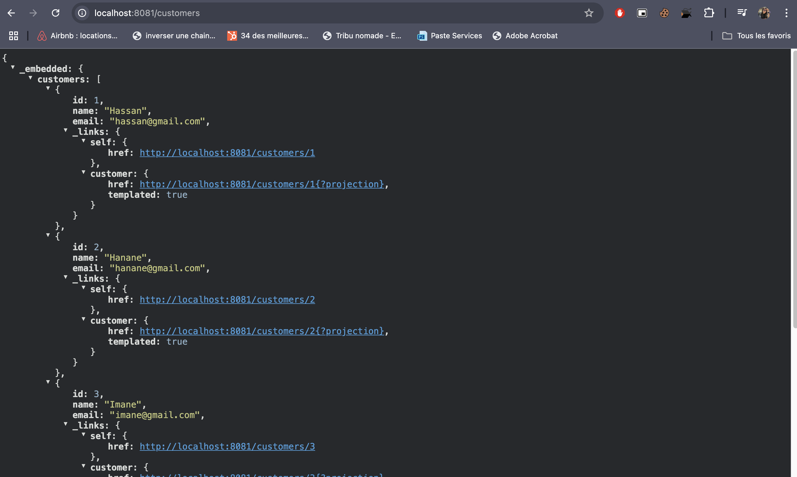

**2.Créer le micro-service inventory-service qui permet de gérer les produits**

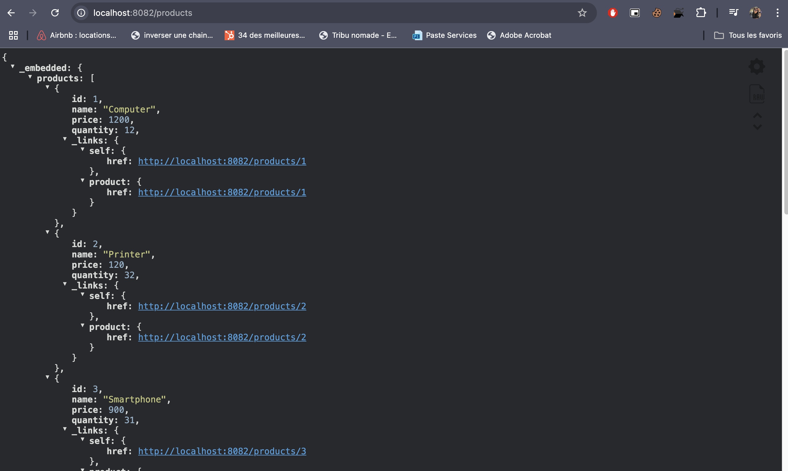

**3.Créer la Gateway Spring cloud Gateway**

**4.Configuration statique du système de routage**

->Via le fichier yml 

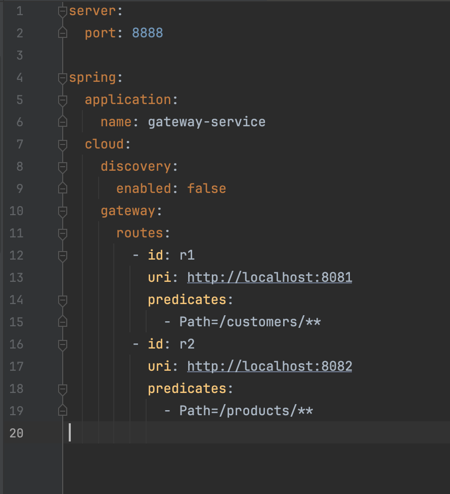

->Par création de la classe de configuration

Résulat: 

Pour inventory-service:
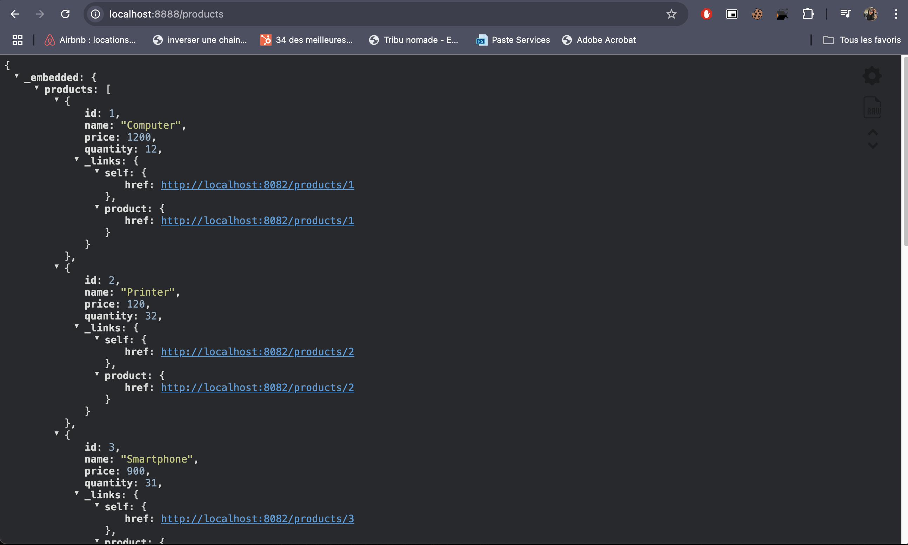

Pour customer-service
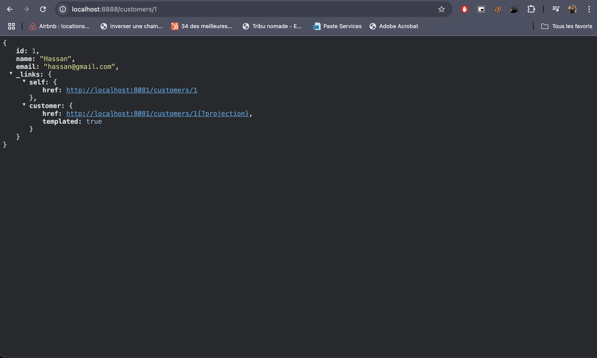

Pour faire une configuration dynamique il faut créer le discovery service

**5.Créer l'annuaire Eureka Discrovery Service**

L'interface Eureka : 
Pour le moment y a aucun microservice parce qu'on ne les pas activer
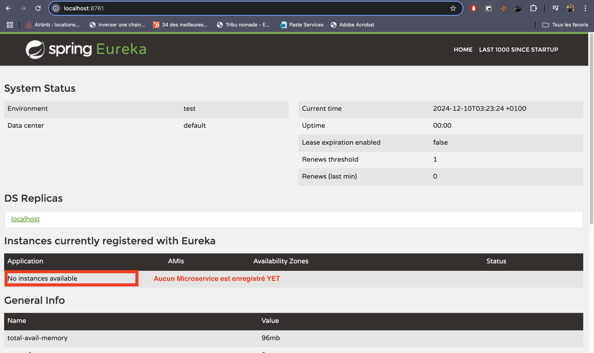

Apres activation des microservices avec : spring.cloud.discovery.enabled=true
Remarquez les microservices enregistrees 
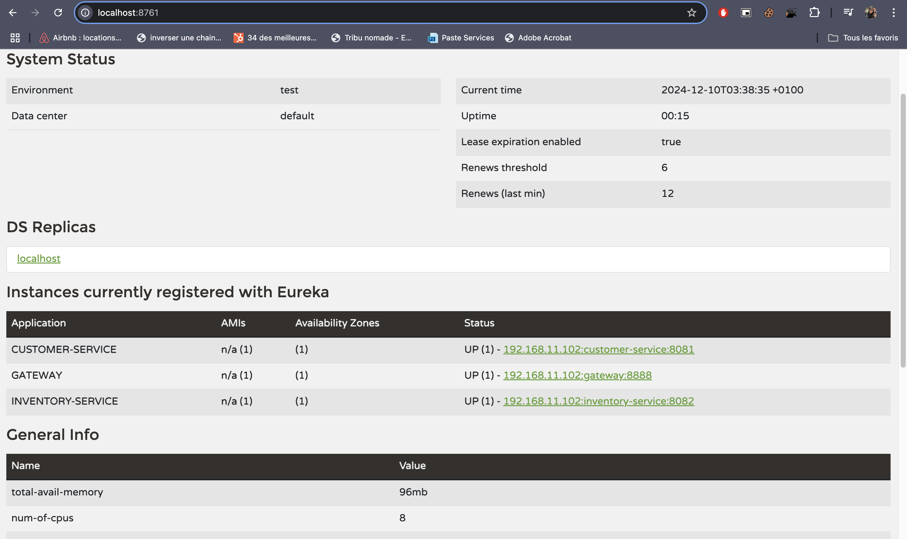
**6.Faire une configuration dynamique des routes de la gateway**

a chaque fois que j'envoie la requete je dois preciser le nom du microservice dans l'url
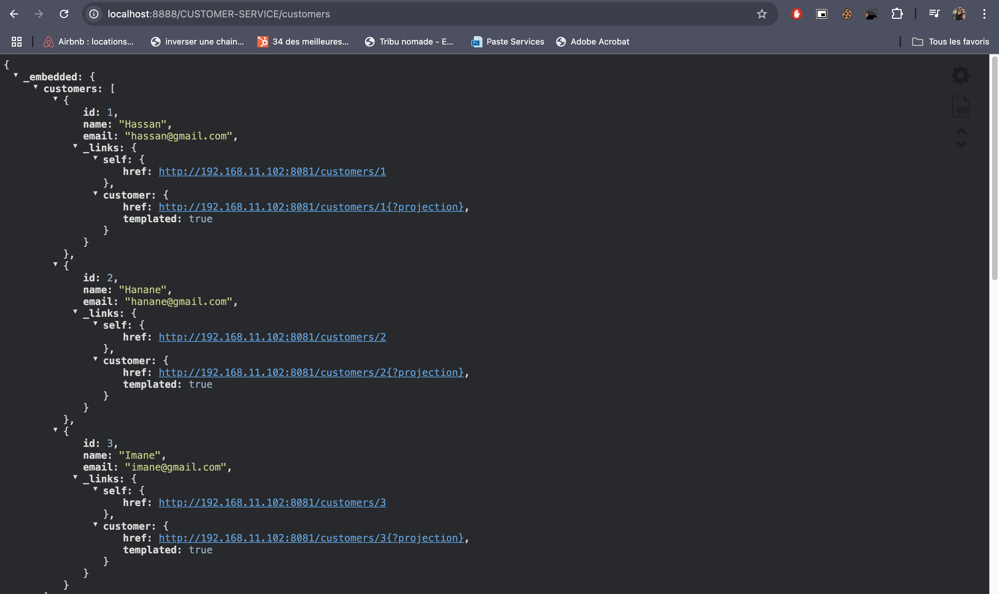

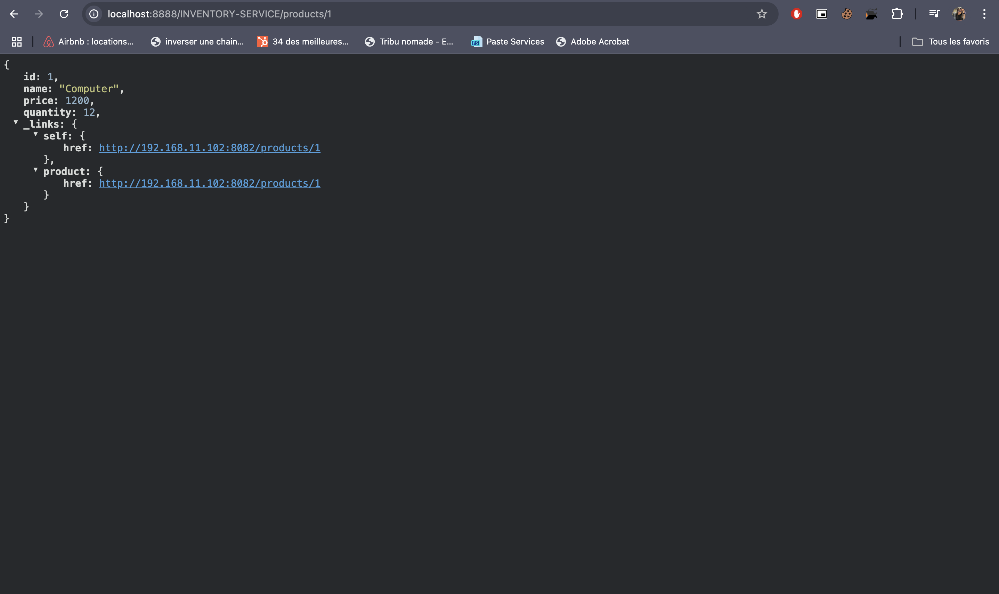

**7.Créer le service de facturation Billing-Service en utilisant Open Feign**

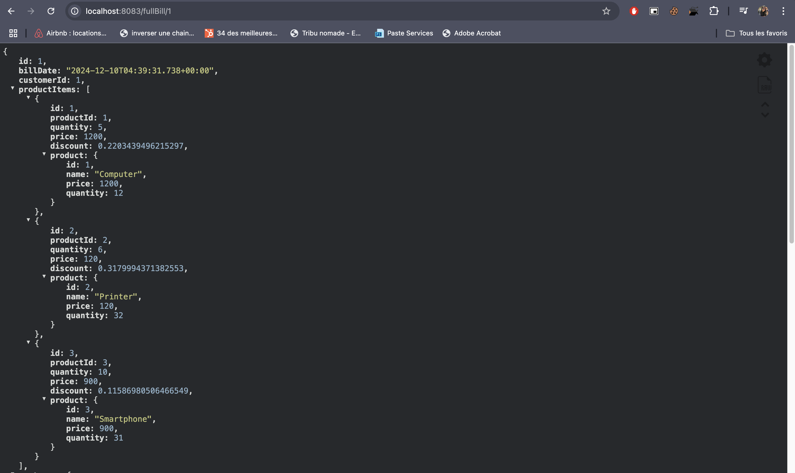
-> openfeign : framework qui permet de creer un client rest de maniere declarative

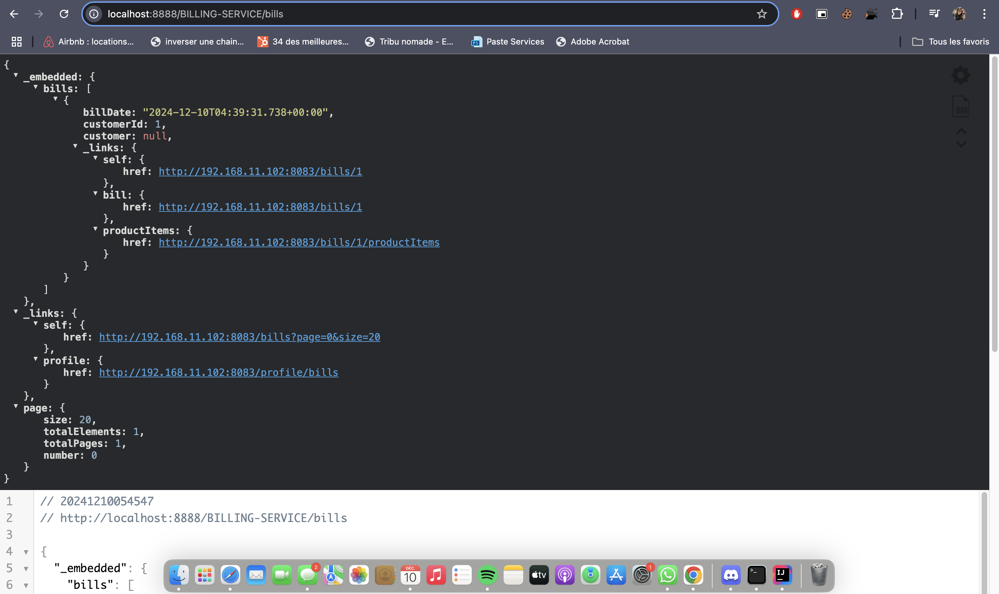

